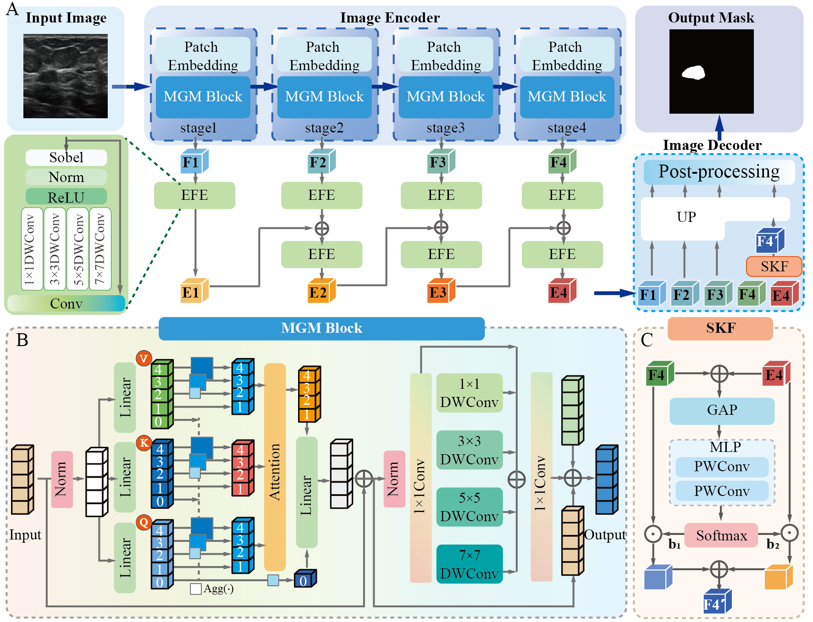
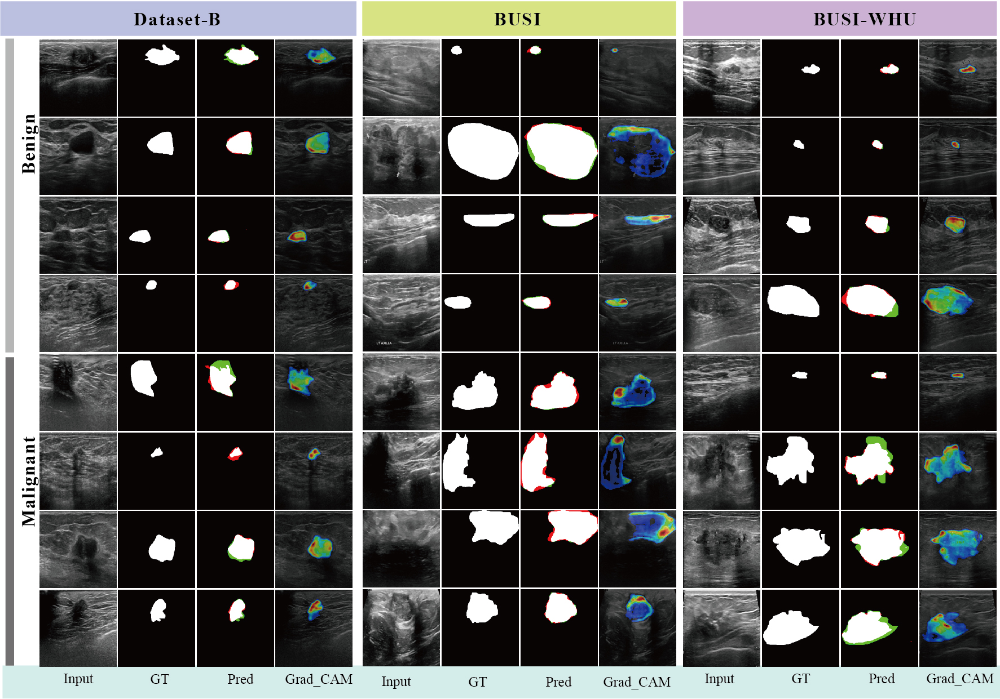

<h1 align="center">
  EMGANet
</h1>

<p align="center">
  
  <br>
  <rm>Figure 1: EMGANet Architecture</rm>
</p>

**📖Title：** Edge-Aware Multi-Scale Group-Mix Attention Network for Breast Cancer Ultrasound Image Segmentation

**👨‍💻Author：** Huang, Jin and Mao, Yazhao and Deng, Jingwen and Ye, Zhaoyi and Zhang, Yimin and Zhang, Jingwen and Dong, Lan and Shen, Hui and Hou, Jinxuan and Xu, Yu and Li, Xiaoxiao and Liu, Sheng and Wang, Du and Sun, Shengrong and Mei, Liye and Lei, Cheng

**Link：**  [IEEE Xplore🔗](https://ieeexplore.ieee.org/document/10906450) [Project Website🔗](https://www.lei-whu.com)

**📜Abstract:** <p align="justify">Breast cancer is one of the most prevalent diseases for women worldwide. Early and accurate ultrasound image segmentation plays a crucial role in reducing mortality. Although deep learning methods have demonstrated remarkable segmentation potential, they still struggle with challenges in ultrasound images, including blurred boundaries and speckle noise. To generate accurate ultrasound image segmentation, this paper proposes the Edge-Aware Multi-Scale Group-Mix Attention Network (EMGANet), which generates accurate segmentation by integrating deep and edge features. The Multi-Scale Group Mix Attention block effectively aggregates both sparse global and local features, ensuring the extraction of valuable information. The subsequent Edge Feature Enhancement block then focuses on cancer boundaries, enhancing the segmentation accuracy. Therefore, EMGANet effectively tackles unclear boundaries and noise in ultrasound images. We conduct experiments on two public datasets (Dataset- B, BUSI) and one private dataset which contains 927 samples from Renmin Hospital of Wuhan University (BUSIWHU). EMGANet demonstrates superior segmentation performance, achieving an overall accuracy (OA) of 98.56%, a mean IoU (mIoU) of 90.32%, and an ASSD of 6.1 pixels on the BUSI-WHU dataset. Additionally, EMGANet performs well on two public datasets, with a mIoU of 88.2% and an ASSD of 9.2 pixels on Dataset-B, and a mIoU of 81.37% and an ASSD of 18.27 pixels on the BUSI dataset. EMGANet achieves a state-of-the-art segmentation performance of about 2% in mIoU across three datasets. In summary, the proposed EMGANet significantly improves breast cancer segmentation through Edge-Aware and Group-Mix Attention mechanisms, showing great potential for clinical applications.</p>


# Introduction
This is an official implementation of [EMGANet: Edge-Aware Multi-Scale Group-Mix Attention Network for Breast Cancer Ultrasound Image Segmentation](https://ieeexplore.ieee.org/document/10906450). ...


## 🚀 Quick start
### 1️⃣ Installation
Assuming that you have installed PyTorch and TorchVision, if not, please follow the [officiall instruction](https://pytorch.org/) to install them firstly. 
Intall the dependencies using cmd:

``` sh
python -m pip install -r requirements.txt --user -q
```

All experiments use the PyTorch 1.8 framework in a Python 3.10 environment. Other versions of pytorch and Python are not fully tested.
### 📂 Data preparation
We have evaluated segmentation performance on two public datasets, [Dataset-B](https://ieeexplore.ieee.org/document/8003418) and [BUSI](https://www.sciencedirect.com/science/article/pii/S2352340919312181), and one private dataset, [BUSI-WHU](https://data.mendeley.com/datasets/k6cpmwybk3/3). We have provided the BUSI-WHU dataset [BUSI-WHU](https://data.mendeley.com/datasets/k6cpmwybk3/3) and [Information](https://github.com/huangjin520/EMGANet/blob/main/Dataset/BUSI_WHU/BUSI-WHU_information.xlsx) in the directory. Please prepare the data as following:

``` sh
|-DATASET
  |-BUSI-WHU
    |-train
    | |-img
    | | |-img1.bmp
    | | |-img2.bmp
    | | |-...
    | |-mask
    | | |-mask1.bmp
    | | |-mask2.bmp
    | | |-...
    |-val
    | |-img
    | | |-img1.bmp
    | | |-img2.bmp
    | | |-...
    | |-mask
    | | |-mask1.bmp
    | | |-mask2.bmp
    | | |-...
    |-test
    | |-img
    | | |-img1.bmp
    | | |-img2.bmp
    | | |-...
    | |-mask
    | | |-mask1.bmp
    | | |-mask2.bmp
    | | |-...
      
```

### Training
The EMGANet model can be trained on BUSI-WHU training set using the following: 

```
python train_BUSI_WHU.py 
``` 

The parameters of the model have been carefully designed. 

EMGANet - Hardware: an NVIDIA RTX 3090 GPU and an Intel Core i9-10900X CPU.


## 📊 Evaluation
The EMGANet model can be evaluated on BUSI-WHU validation set using the following: 

```
python eval.py 
``` 
<p align="center">
  
  <br>
  <rm>Figure 2:  EMGANet’s performance on Dataset-B, BUSI, and BUSI-WHU Datasets in benign and malignant samples. Red(false negatives),green (false positives).</rm>
</p>

**Table**: Quantitative performance of state-of-the-art methods on private BUSI-WHU, highlighting the best results in <span style="color:#F28D6A">red</span> and the second best in <span style="color:#5D9CEC">blue</span>.

| Method                          | OA (\%) | Kappa (\%) | Precision (\%) | Recall (\%) | mIoU (\%) | ASSD |
|----------------------------------|---------|------------|----------------|-------------|-----------|------|
| U-Net<sub>2015</sub>             | 98.48   | 88.33      | 92.75          | 85.80       | 89.39     | 5.69 |
| SegNet<sub>2017</sub>            | <span style="color:#5D9CEC">98.59</span>  | 89.18      | <span style="color:#F28D6A">92.97</span> | 87.10       | 90.10     | 6.37 |
| TransUnet<sub>2021</sub>         | 98.30   | 86.83      | 92.20          | 83.69       | 88.17     | 11.14 |
| MDA-Net<sub>2022</sub>           | 97.76   | 82.23      | 89.91          | 77.81       | 84.59     | <span style="color:#F28D6A">5.29</span> |
| DualA-Net<sub>2023</sub>         | 98.50   | 88.55      | 92.06          | 86.81       | 89.58     | 6.35 |
| EGEUNet<sub>2023</sub>           | 98.42   | 87.86      | 92.17          | 85.49       | 89.01     | 6.73 |
| MGCC<sub>2023</sub>              | <span style="color:#5D9CEC">98.59</span>  | 89.22      | 92.74          | 87.38       | 90.14     | <span style="color:#5D9CEC">5.39</span> |
| EH-Former<sub>2024</sub>         | <span style="color:#F28D6A">98.61</span>  | <span style="color:#5D9CEC">89.41</span> | <span style="color:#5D9CEC">92.95</span> | 87.51       | <span style="color:#5D9CEC">90.29</span> | 5.53 |
| ScribFormer<sub>2024</sub>       | 98.56   | 89.19      | 91.11          | <span style="color:#5D9CEC">88.84</span>  | 90.11     | 5.90 |
| **EMGANet**                       | <span style="color:#F28D6A">98.56</span>  | <span style="color:#F28D6A">89.45</span> | 88.57          | <span style="color:#F28D6A">91.95</span>  | <span style="color:#F28D6A">90.32</span> | 6.10 |


## 📜 Citation
If you find this work or code is helpful in your research, please cite:
### 📌 1. EMGANet (JBHI 2025)
EMGANet (JBHI 2025)[IEEE Xplore🔗](https://ieeexplore.ieee.org/document/10906450) [Github🔗](https://github.com/huangjin520/EMGANet) [Project Website🔗](https://www.lei-whu.com)
```
J. Huang et al., "EMGANet: Edge-Aware Multi-Scale Group-Mix Attention Network for Breast Cancer Ultrasound Image Segmentation," in IEEE Journal of Biomedical and Health Informatics, doi: 10.1109/JBHI.2025.3546345.
```

### 📌 2. DSATNet (Medical Physics 2025)
DSATNet (MP 2025)[Wiley 🔗](https://aapm.onlinelibrary.wiley.com/doi/10.1002/mp.17751) [Github🔗](https://github.com/Skylanding/DSATNet) [Project Website🔗](https://www.lei-whu.com)
```
Li Y, Huang J, Zhang Y, et al. Dual branch segment anything model‐transformer fusion network for accurate breast ultrasound image segmentation[J]. Medical Physics.
```
## 📬 Contact
For any questions or collaborations, please contact [Jin Huang](mailto:jinhuang@whu.edu.cn), [Yazhao Mao](mailto:maoyazhao@whu.edu.cn), [Zhaoyi Ye](mailto:yezhaoyi@whu.edu.cn) or open an issue on GitHub.


****
